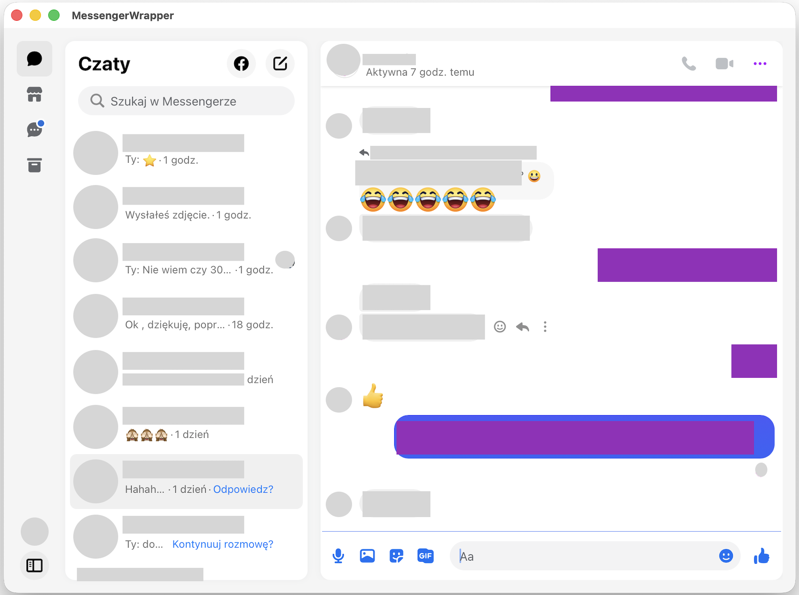

# MessengerWrapper

Lekka aplikacja macOS, która owija `messenger.com` w natywne okno SwiftUI/WebKit, dodając badge w Docku, integrację z paskiem menu i powiadomienia lokalne.

  

## Funkcje
- Natywne okno SwiftUI z WebKit (bez Electron).
- Ikona template w pasku menu + licznik nieprzeczytanych obok niej; menu z akcjami pokaż/zakończ.
- Badge Docka z liczbą nieprzeczytanych (parsowany tytuł strony).
- Lokal­ne powiadomienia (alert + dźwięk + badge) gdy rośnie liczba nieprzeczytanych.
- Blokowanie otwierania linków zewnętrznych w aplikacji — są przekazywane do domyślnej przeglądarki.

## Instalacja

Paczka zip z [Releases](https://github.com/growdelan/MessengerWrapper/releases)  
Rozpoakować do `/Applications/` 

## Wymagania do samodzielnego budowania
- macOS z Xcode (testowane z nowszymi wersjami Xcode i SDK macOS).
- Dostęp do internetu dla `messenger.com` i hostów statycznych Facebooka.

## Budowa i uruchomienie
1. Otwórz projekt: `open MessengerWrapper.xcodeproj`.
2. Wybierz schemat `MessengerWrapper` i platformę macOS.
3. Uruchom (`⌘R`) lub zbuduj (`⌘B`).  
Alternatywnie z CLI:  
`xcodebuild -project MessengerWrapper.xcodeproj -scheme MessengerWrapper -destination 'platform=macOS' -derivedDataPath ./_DerivedData build`

## Uprawnienia i zachowanie
- Powiadomienia: przy pierwszym uruchomieniu aplikacja poprosi o pozwolenie (`UNUserNotificationCenter`); odrzucenie wyłącza alerty, ale nie psuje działania.
- Sesja: cookies i dane strony są trzymane lokalnie w `WKWebsiteDataStore.default()`.
- Status bar: wykorzystywany jest asset `MenuBarIcon` (template); licznik dodawany jest w tytule obok ikony.
- Ukrywanie okna: zamknięcie okna chowa je zamiast kończyć aplikację; wyjście dostępne z menu paska.

## Struktura projektu
- `MessengerWrapper/` – kod źródłowy SwiftUI i WebKit.
- `MessengerWrapper.xcodeproj` – konfiguracja Xcode.
- `Assets.xcassets` – zasoby graficzne.

## Dostosowanie
- Dozwolone hosty linków zewnętrznych znajdują się w `MessengerWebView.swift` (`allowedHosts`); aktualizuj przy zmianach routingu.
- Licznik nieprzeczytanych jest parsowany natywnie z `document.title` (regex na formatach `(3) Messenger`/`Messenger (3)`); dostrój, jeśli Messenger zmieni tytuł.
